### Integrantes:
- Armas Alejandro
- Catota Luis
- Guala Paul
- Guallichico Nataly

### App Ciclistas - Manual técnico

**0. Configuraciones**
> AndroidManifest.xml
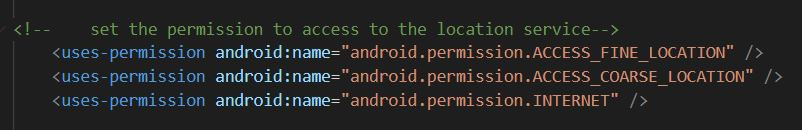

> build.gradle (general)
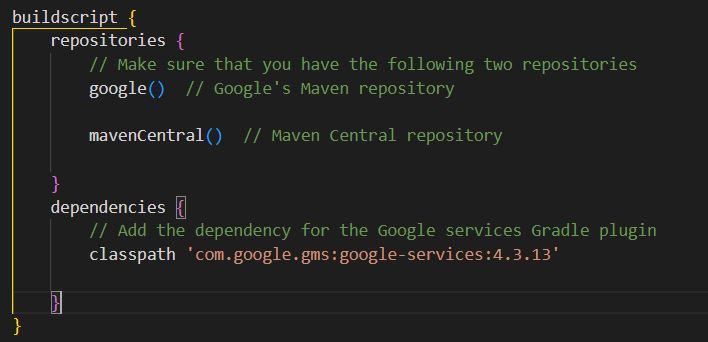

> build.gradle (app)
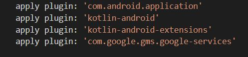
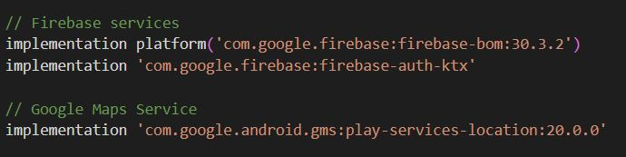

**1. Estructura del directorio**

Los principales archivos que componen la aplicación son dos: Login.kt y _Profile.kt_.

   

**2. Login.kt**  
Implementa la funcionalidad de inicio de sesión y registro de usuario. La clase inicializa la configuración de su layout y, a continuación, ejecuta la función <em>setup()</em>.

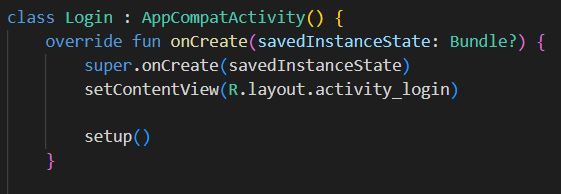

La función <em>setup()</em> configura las funcionalidades de los botones de _Inicio de sesión_ y de _Registro de usuario_. Al registrar un usuario, se almacenan sus credenciales en Firestore de Firebase, a la vez que se autentica al usuario en su servicio.

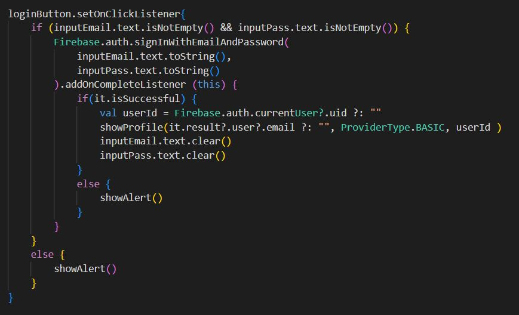

Mientras la funcionalidad del botón de inicio se sesión se muestra en la siguiente imagen:

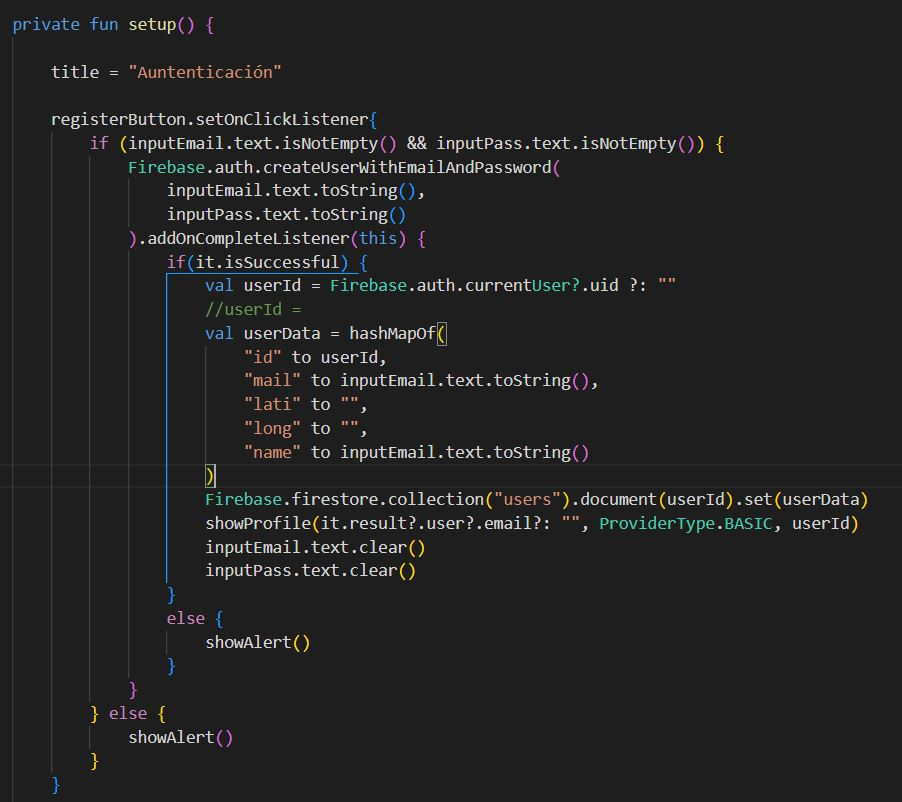

Finalmente, la función <em>showProfile()</em> permite la navegación hacia la pantalla de perfil del usuario, enviando las credenciales del usuario mediante un contenedor de tipo _Bundle_, que será aceptado por la clase Profile.

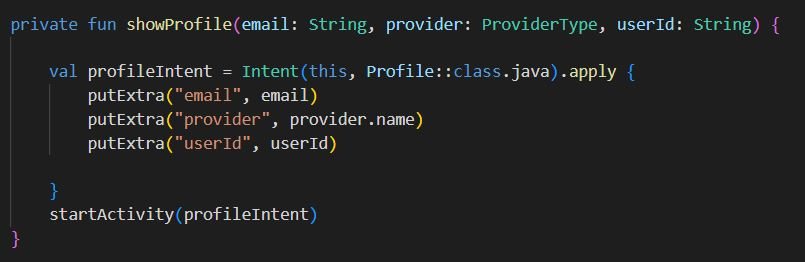

 

**3. Profile.kt**  
Implementa la funcionalidad de localización mediante el servicio de Google Play.

En primer lugar, la clase inicializa la referencia a _Firestore_ para el alacenamiento de los datos, y _locationRequest_ para utilizar el servicio de Google Play.

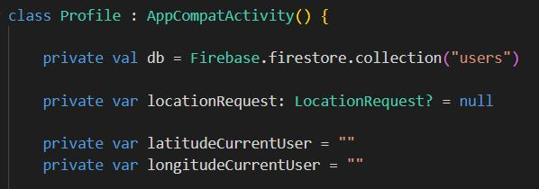

A continuación, se configura la función <em>create()</em> para el servicio de localización, se configura el tiempo de actualización del la posición del usuario, y se extraen los valores enviados por la interfaz anterior mendiante el contenedor _bundle_.

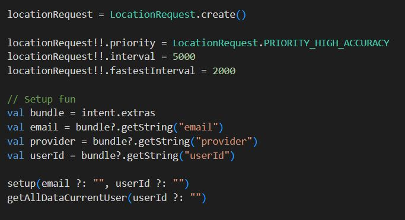

Al iniciarse la interfaz de perfil del usuario, se le solicita que active la función de localización en su teléfono móvil para registrar su posición actual, mediante la ejecución de la función <em>getCurrentLocation()</em>.

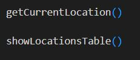

Esta función obtiene la ubicación actual del usuario. En primer lugar, verifica la correcta configuración de las versiones del SDK del servicio de Google. Además, configura los permisos para el acceso a los servicios de dispositivo

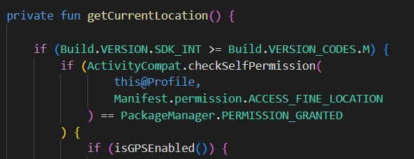

Si la ubicación no se encuentra activa, ejecuta la función <em>turnOnGPS()</em> para la activación de la localización. Si la ubicación está activa, evalua el resultado obtenido de los datos de ubicación: si los datos son nulos (_null_) y el objeto de respuesta es vacío, ejecuta un bucle continuo hasta la obtención de datos. Una vez se obtiene una respuesta, setea los valores de latitud y longitud, los muestra en la interfaz y los actualiza en la base de datos de Firestore.

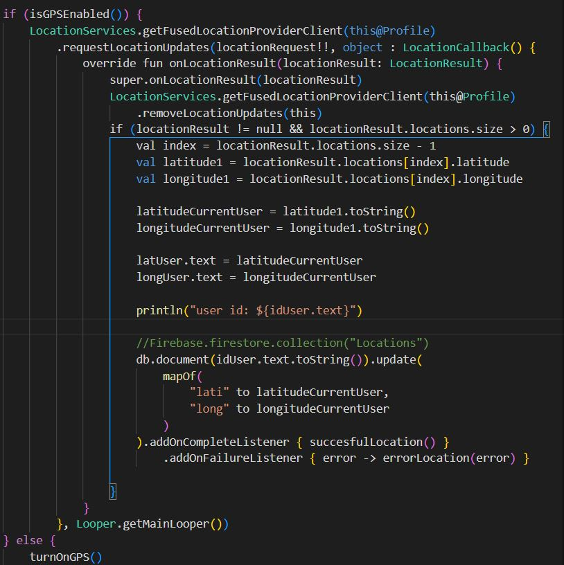

La función <em>turnOnGPS()</em> permite la activación de la función de localización en el dipositivo, en caso de no estar activado. El valor _result_ ejecuta el servicio de solicitud de las configuraciones del dispositivo, en este caso, la configuración de la función de localización.

A continuación, evalua el resultado obtenido. Si la localización está activada, presentará un mensaje tipo _Toast_ informado de su estado. Caso contrario, mostrará en pantalla una tarjeta para la activación de este servicio.

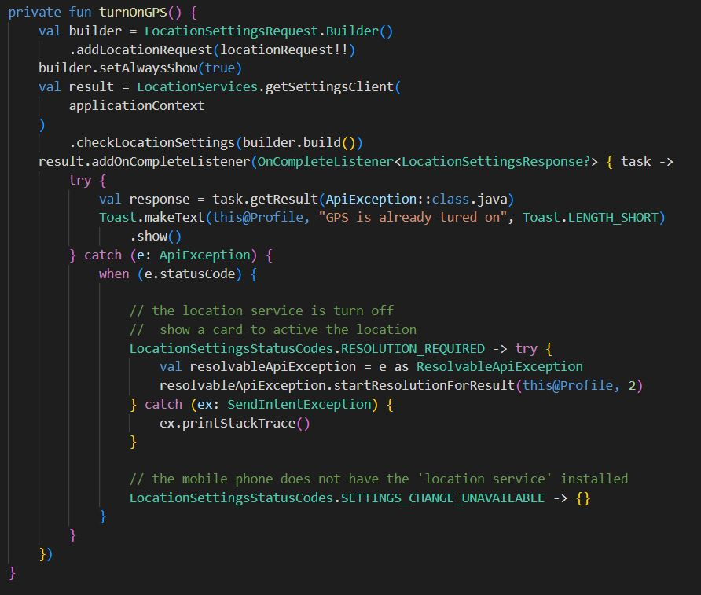

La función <em>isGPSEnabled()</em> verifica si el servicio de localización está activado, mediante la clase _LocationManager_.

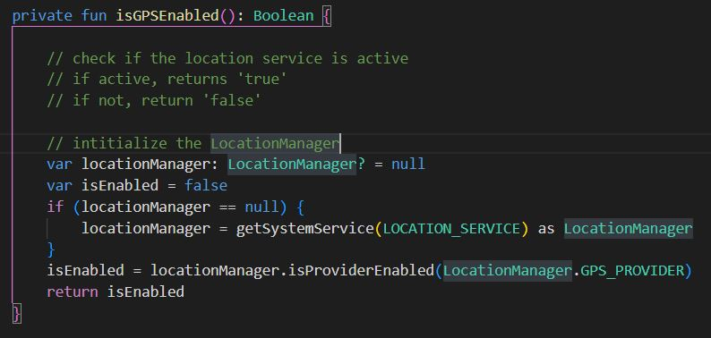

### **Enlaces**

[Video Manual de Usuario](https://www.youtube.com/watch?v=xl8uGf5iNIQ)

[Video Explicación Técnica](https://youtu.be/TgirbT_Xez0)
